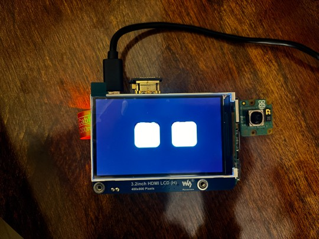
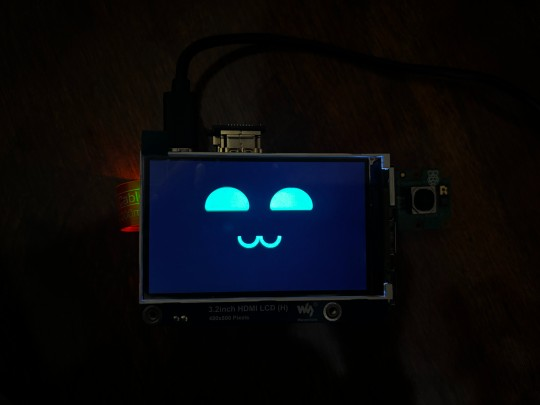
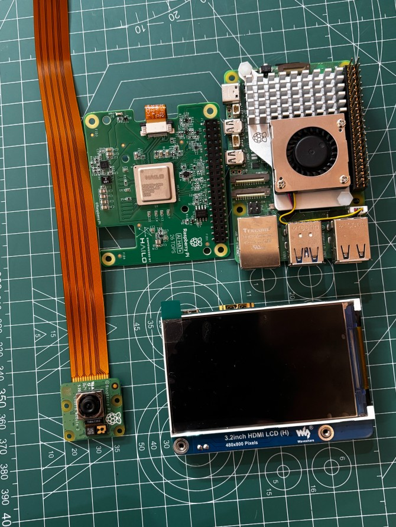

# Bot Ekko

Bot Ekko is a Raspberry Pi-based robot with an expressive digital face. It features an event-driven architecture that manages emotional states, sensor inputs, local communication (Bluetooth), and media playback.

# Gallery

<table>
  <tr>
    <td width="50%"></td>
    <td width="50%"></td>
  </tr>
  <tr>
    <td width="50%"></td>
    <td width="50%"></td>
  </tr>
</table>


## Architecture

The project is structured around a central **State Machine** that dictates the robot's behavior (e.g., Happy, Sleeping, Angry). A **Command Center** handles asynchronous commands from various services to modify this state.

### Core Components (`bot_ekko/core/`)
- **`state_machine.py`**: Manages the robot's current state and history.
- **`display_manager.py`**: Handles Pygame surface initialization and scaling.
- **`movements.py`**: Base classes (`BaseMovements`) for preset movements.
- **`scheduler.py`**: Manages time-based state changes (Daily/Hourly events).

### UI Expressions Library (`bot_ekko/ui_expressions_lib/`)
Pluggable expression engines that define how the robot's face renders and animates.
- **`eyes/`**: The original dynamic eye implementation.
- **`bmo/`**: An alternative BMO face implementation with its own `physics.py` and `expressions.py`.

### Services (`bot_ekko/services/`)
Services run as independent threads or processes.
- **`service_bt.py`**: Bluetooth Low Energy (BLE) peripheral for smartphone control.
- **`service_sensors.py`**: interfaces with external hardware (e.g., ESP32) via Serial.
- **`service_gesture.py`**: Listens for gesture data via Unix Domain Socket.
- **`service_system_logs.py`**: Monitors CPU/GPU stats.

### Modules (`bot_ekko/modules/`)
- **`media_interface.py`**: Handles rendering of GIFs, Images, and Text overlays.
- **`effects.py`**: Procedural visual effects.

### APIs (`bot_ekko/apis/`)
- **`adapters/chat_api.py`**: Interface for LLM chat.
- **`adapters/tenor_api.py`**: Interface for Tenor GIF search.

## Installation

1. **System Requirements**: 
   - Raspberry Pi (OS: Linux/Debian) or macOS for dev (some features like Bluetooth may require Linux).
   - Python 3.8+
   - Pygame

2. **Setup**:
   ```bash
   pip install -r requirements.txt
   ```

3. **Running**:
   ```bash
   sudo python3 main.py
   ```
   *Note: `sudo` is often required for Bluetooth/Serial access on Pi.*

## Configuration

- **`bot_ekko/config.json`**: Configure the visual engine (`ui_expression_config`) and enable/disable specific services.
- **`schedule.json`**: Define time-based behaviors.
- **`bot_ekko/sys_config.py`**: System-wide constants (resolution, colors, standard durations).

## Usage

- **Bluetooth**: Connect using a BLE App (Service UUID: `1234...`). Send commands like `STATE;HAPPY`.
- **Sensors**: Connect ESP32 to Serial Port defined in config.
- **Gestures**: Send JSON to `/tmp/ekko_gesture.sock`.
